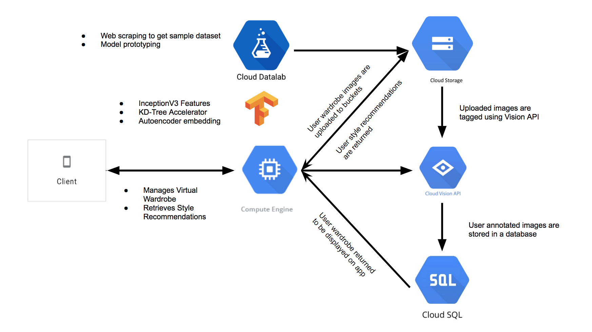

# Google Cloud Sprint Hackathon 2018
### Your AI Powered Wardrobe

#### Architecture


### Development

Run requirements.txt
```
$ pip -r requirements.txt
```

To start a development server on `8080` that will watch for code changes simply run:
```
$ python main.py
```
